# 24. Service Discovery

Service discovery is the answer to "Where do I find the user service?" In a monolith, the answer is "localhost:8001". In microservices, the answer is "somewhere on a cluster of 500 servers, probably. Maybe. Check back in 5 minutes." 🔍

[← Back to Main](../README.md) | [Previous: API Gateways](23-api-gateways.md) | [Containers & Orchestration (Docker, Kubernetes)](25-containers-orchestration.md)

---

## 🎯 Quick Summary

**Service Discovery** is how microservices find each other in dynamic environments. Instances appear and disappear (auto-scaling, failures, deployments). Services need to know where to connect. Consul, Eureka, Kubernetes DNS, etcd handle this. Without it: hardcoded IPs fail when servers change. With it: automatic registration, health checks, load balancing. Essential for microservices and Kubernetes deployments.

Think of it as: **Service Discovery = Dynamic Phone Book for Services**

---

## 🌟 Beginner Explanation

### The Problem: Dynamic Infrastructure

**TRADITIONAL (Static):**

```
Server 1: user-service.internal:8001
Server 2: order-service.internal:8002
Server 3: payment-service.internal:8003

Hardcoded in application:
user_service_url = "user-service.internal:8001"
order_service_url = "order-service.internal:8002"

Problem:
├─ User Service moves to new server? Update code!
├─ Need to scale user service? Add new instances?
│  How do clients know about them?
├─ Old instance crashes? Clients timeout trying to reach
└─ Manual changes, no automation
```

**CLOUD-NATIVE (Dynamic):**

```
Kubernetes cluster: Pods start and stop constantly

Pod 1 (user-service): 10.0.0.5:8001 (running)
Pod 2 (user-service): 10.0.0.6:8001 (starting)
Pod 3 (user-service): 10.0.0.4:8001 (terminating)

Service Discovery automatically:
├─ Register new instances when they start
├─ Remove crashed instances
├─ Track healthy instances only
├─ Load balance across instances
└─ Application: Just call "user-service", service discovery handles rest!
```

```mermaid
graph TD
    subgraph Static_World [Old Way: Static & Fragile]
    A[Client] -- "Hardcoded IP: 10.0.0.1" --> B[Service A]
    B -- "Crash/Move" --> X[Connection Failed ❌]
    style X fill:#ffcccc,stroke:#ff0000
    end
    
    subgraph Dynamic_World [New Way: Dynamic & Robust]
    C[Client] -- "Where is Service A?" --> D[Service Discovery]
    D -- "It's at 10.0.0.5" --> C
    C -- "Connect 10.0.0.5" --> E[Service A (New IP)]
    style E fill:#ccffcc,stroke:#00ff00
    end
```

### Service Registry

```
WHAT IS A REGISTRY?

Central database:
┌─────────────────────────────┐
│ Service Registry            │
├─────────────────────────────┤
│ user-service:               │
│ ├─ Instance 1: 10.0.0.5:8001│
│ ├─ Instance 2: 10.0.0.6:8001│
│ ├─ Instance 3: 10.0.0.7:8001│
│                             │
│ order-service:              │
│ ├─ Instance 1: 10.0.0.10:8002
│ ├─ Instance 2: 10.0.0.11:8002
│                             │
│ payment-service:            │
│ └─ Instance 1: 10.0.0.20:8003
└─────────────────────────────┘

When instance starts:
├─ Register: "Hi, I'm user-service at 10.0.0.5:8001"
├─ Registry adds to list
└─ Ready to receive traffic!

When instance fails:
├─ Health check fails
├─ Registry removes from list
└─ No more traffic sent there
```



```mermaid
classDiagram
    class ServiceRegistry {
        +Register("I'm here!")
        +Deregister("I'm leaving!")
        +GetHealthyInstances("Who is available?")
    }
    class UserService {
        IP: 10.0.0.1
        Port: 8080
    }
    class OrderService {
        IP: 10.0.0.2
        Port: 8081
    }
    UserService ..> ServiceRegistry : 1. Register on Startup
    OrderService ..> ServiceRegistry : 1. Register on Startup
    note for ServiceRegistry "Keeps track of who is alive via Heartbeats ❤️"
```

### Client-Side vs Server-Side Discovery

**CLIENT-SIDE DISCOVERY:**

```
Client asks registry, gets list, picks one

Client: "Where is user-service?"
        ↓
Registry: "At 10.0.0.5:8001, 10.0.0.6:8001, 10.0.0.7:8001"
        ↓
Client picks one (e.g., 10.0.0.5:8001)
        ↓
Client connects directly

Pros:
✅ Client controls load balancing
✅ Direct connection (low latency)

Cons:
❌ Client needs discovery logic
❌ Client needs retry/failover logic
❌ Complex at scale
```


**SERVER-SIDE DISCOVERY:**

```
Load balancer handles discovery

Client: "Send to user-service"
        ↓
Load Balancer: Asks registry "Where is user-service?"
              Gets list: 10.0.0.5:8001, 10.0.0.6:8001, etc.
              Picks one (via load balancing algorithm)
        ↓
Load Balancer connects to picked instance
        ↓
Returns response to client

Pros:
✅ Client simple (doesn't know about discovery)
✅ Load balancer handles complexity
✅ Centralized control

Cons:
❌ Load balancer is extra hop
❌ Load balancer becomes bottleneck
```


---

## 🔬 Advanced Explanation

### Service Discovery Flow

**REGISTRATION (Instance Starts):**

```
New pod starts in Kubernetes

Pod initialization:
├─ Application starts
├─ Reads environment variables (service name, port)
├─ Calls discovery service: "Register me!"
│  Data:
│  {
│    "service_name": "user-service",
│    "instance_id": "user-service-1234",
│    "ip": "10.0.0.5",
│    "port": 8001,
│    "health_check_url": "/healthz",
│    "metadata": {"version": "2.0", "region": "us-west"}
│  }
├─ Discovery service stores in registry
├─ Heartbeat starts (periodic "I'm alive" signals)
└─ Ready for traffic!
```

**DISCOVERY (Service Needs Another Service):**

```
Service A needs to call Service B

Service A:
├─ Calls discovery service: "Where is service-b?"
├─ Discovery returns:
│  [
│    {"ip": "10.0.0.10", "port": 8002, "healthy": true},
│    {"ip": "10.0.0.11", "port": 8002, "healthy": true}
│  ]
├─ Load balancer picks one (e.g., 10.0.0.10)
├─ Connects and makes request
└─ If fails, retries with another instance
```

**HEALTH CHECKING:**

```
Registry periodically checks if instances healthy

For each registered instance:
├─ Call health check endpoint (GET /healthz)
├─ If responds 200 OK: Mark healthy ✅
├─ If timeout or 503: Mark unhealthy ❌
├─ If unhealthy for N seconds: Remove from registry
└─ Stop sending new traffic there

Result:
✅ Only healthy instances get traffic
✅ Failed instances automatically removed
✅ Auto-recovery when instance comes back
```

### Service Discovery Patterns

**PATTERN 1: DNS-BASED:**

```
Service name resolves to IP via DNS

user-service.namespace.svc.cluster.local
    ↓
DNS resolution (automatic!)
    ↓
Returns: 10.0.0.5, 10.0.0.6, 10.0.0.7 (round-robin)

Used by: Kubernetes (built-in), many cloud systems

Pros:
✅ Simple (just use hostname)
✅ Standard (DNS everywhere)
✅ Automatic load balancing

Cons:
❌ DNS TTL can cause stale data
❌ Limited health checking
❌ Slow to update
```

**PATTERN 2: REGISTRY-BASED:**

```
Dedicated registry service (Eureka, Consul, etcd)

Service A: "Where is service B?"
        ↓
Registry: "Here are all instances of B"
        ↓
Service A picks and connects

Used by: Spring Cloud (Eureka), Consul, Kubernetes Ingress

Pros:
✅ Powerful health checks
✅ Real-time updates
✅ Metadata support

Cons:
❌ Extra component (single point of failure)
❌ Complex setup
❌ Requires client library
```

**PATTERN 3: API GATEWAY + DISCOVERY:**

```
All calls go through API Gateway

Client: "Call user-service"
    ↓
API Gateway: Queries discovery "Where is user-service?"
    ↓
API Gateway: Picks instance, forwards request
    ↓
Client gets response

Used by: Kong, AWS API Gateway, Kubernetes Ingress

Pros:
✅ Client completely simple
✅ Centralized control
✅ Can implement smart routing

Cons:
❌ Extra hop (latency)
❌ Gateway is bottleneck
```

### Challenges

**EVENTUAL CONSISTENCY:**

```
PROBLEM: Stale data

T=0: Instance A registered
T=1: All services see Instance A
T=2: Instance A crashes
T=2.5: Discovery removes Instance A
T=3: Some services still think A exists (stale cache!)
T=3.5: All services finally know A is gone

During T=2.5 to T=3.5:
├─ New requests might go to dead instance A
├─ Connection timeout
├─ Retry needed
└─ Poor user experience

SOLUTION: Retry logic in clients
├─ If connection fails to Instance A
├─ Try Instance B
├─ Eventually reach healthy instance
```

**THUNDERING HERD:**

```
PROBLEM: All clients ask discovery at once

T=0: Instance A fails
T=0.1: Discovery marks A unhealthy
T=0.2: 1000 clients notice (all have retry logic)
T=0.3: All 1000 clients ask discovery "Give me new instances"
T=0.4: Discovery gets hammered with 1000 requests/sec!

SOLUTION: Caching + Jitter
├─ Clients cache list for N seconds
├─ Add random delay before requesting new list
├─ Spread out requests over time
└─ Discovery doesn't get overwhelmed
```

---

## 🐍 Python Code Example

### ❌ Without Service Discovery (Hardcoded)

```python
# ===== WITHOUT SERVICE DISCOVERY =====

class Application:
    """Hardcoded service URLs"""
    
    def __init__(self):
        # Hardcoded!
        self.user_service_url = "http://10.0.0.5:8001"
        self.order_service_url = "http://10.0.0.10:8002"
        self.payment_service_url = "http://10.0.0.20:8003"
    
    def get_user(self, user_id):
        """Call user service"""
        # If server at 10.0.0.5 crashes:
        # - Connection timeout
        # - User sees error
        # - Must manually update config
        response = requests.get(f"{self.user_service_url}/users/{user_id}")
        return response.json()
    
    def get_orders(self, user_id):
        """Call order service"""
        # If we scale order service (add new instance):
        # - New instance not in hardcoded URL
        # - Traffic not distributed to new instance
        # - Doesn't help with scaling
        response = requests.get(f"{self.order_service_url}/orders?user={user_id}")
        return response.json()

# Problems:
# ❌ Crashes require manual fix
# ❌ Scaling doesn't work
# ❌ Can't handle dynamic infrastructure
# ❌ Doesn't work in Kubernetes
```

### ✅ Simple Service Discovery (In-Memory)

```python
# ===== SIMPLE SERVICE DISCOVERY =====

import time
from typing import Dict, List
from dataclasses import dataclass

@dataclass
class ServiceInstance:
    """Registered service instance"""
    service_name: str
    instance_id: str
    ip: str
    port: int
    healthy: bool = True
    last_heartbeat: float = None

class SimpleServiceRegistry:
    """Simple in-memory service registry"""
    
    def __init__(self):
        self.instances: Dict[str, List[ServiceInstance]] = {}
    
    def register(self, service_name: str, instance_id: str, ip: str, port: int):
        """Register instance"""
        if service_name not in self.instances:
            self.instances[service_name] = []
        
        instance = ServiceInstance(
            service_name=service_name,
            instance_id=instance_id,
            ip=ip,
            port=port,
            last_heartbeat=time.time()
        )
        
        self.instances[service_name].append(instance)
        print(f"Registered: {service_name}/{instance_id} at {ip}:{port}")
    
    def deregister(self, service_name: str, instance_id: str):
        """Deregister instance"""
        if service_name in self.instances:
            self.instances[service_name] = [
                i for i in self.instances[service_name]
                if i.instance_id != instance_id
            ]
    
    def discover(self, service_name: str) -> List[ServiceInstance]:
        """Discover healthy instances"""
        if service_name not in self.instances:
            return []
        
        healthy = [
            i for i in self.instances[service_name]
            if i.healthy
        ]
        
        return healthy
    
    def heartbeat(self, service_name: str, instance_id: str):
        """Heartbeat from instance (I'm alive!)"""
        if service_name in self.instances:
            for instance in self.instances[service_name]:
                if instance.instance_id == instance_id:
                    instance.last_heartbeat = time.time()
                    instance.healthy = True

class ServiceClient:
    """Client that uses service discovery"""
    
    def __init__(self, registry: SimpleServiceRegistry):
        self.registry = registry
        self.instance_index = {}  # For round-robin
    
    def call_service(self, service_name: str, path: str):
        """Call service using discovery"""
        
        # Discover instances
        instances = self.registry.discover(service_name)
        
        if not instances:
            raise Exception(f"No instances of {service_name} available")
        
        # Round-robin load balancing
        if service_name not in self.instance_index:
            self.instance_index[service_name] = 0
        
        index = self.instance_index[service_name] % len(instances)
        instance = instances[index]
        self.instance_index[service_name] += 1
        
        # Call service
        url = f"http://{instance.ip}:{instance.port}{path}"
        print(f"Calling: {url}")
        
        # In real code: use requests
        return {"data": "response"}

# Usage
print("=== SIMPLE SERVICE DISCOVERY ===\n")

registry = SimpleServiceRegistry()
client = ServiceClient(registry)

# Register instances
registry.register("user-service", "user-1", "10.0.0.5", 8001)
registry.register("user-service", "user-2", "10.0.0.6", 8001)
registry.register("order-service", "order-1", "10.0.0.10", 8002)

# Call services (automatic load balancing!)
print("Calling user-service:")
client.call_service("user-service", "/users/123")
client.call_service("user-service", "/users/456")

# Instance fails
print("\nInstance dies:")
registry.instances["user-service"][0].healthy = False

print("\nCalling user-service (1st instance dead):")
client.call_service("user-service", "/users/789")
# Automatically goes to 2nd instance!

print("\nAvailable instances:", registry.discover("user-service"))
```

### ✅ Production Service Discovery (Consul-like)

```python
# ===== PRODUCTION SERVICE DISCOVERY =====

import time
import threading
from typing import Dict, List, Callable
from dataclasses import dataclass

@dataclass
class ServiceInstance:
    """Service instance with health checks"""
    service_name: str
    instance_id: str
    ip: str
    port: int
    health_check_url: str
    healthy: bool = True
    last_heartbeat: float = None

class ProductionServiceRegistry:
    """Production-grade service registry"""
    
    def __init__(self, health_check_interval: int = 10):
        self.instances: Dict[str, List[ServiceInstance]] = {}
        self.health_check_interval = health_check_interval
        self.health_check_thread = None
        self.watchers: Dict[str, List[Callable]] = {}
    
    def register(self, service_name: str, instance_id: str, 
                ip: str, port: int, health_check_url: str = "/healthz"):
        """Register instance"""
        if service_name not in self.instances:
            self.instances[service_name] = []
            self.watchers[service_name] = []
        
        instance = ServiceInstance(
            service_name=service_name,
            instance_id=instance_id,
            ip=ip,
            port=port,
            health_check_url=health_check_url,
            last_heartbeat=time.time()
        )
        
        self.instances[service_name].append(instance)
        self._notify_watchers(service_name)
    
    def discover(self, service_name: str) -> List[ServiceInstance]:
        """Get healthy instances"""
        if service_name not in self.instances:
            return []
        
        return [i for i in self.instances[service_name] if i.healthy]
    
    def watch(self, service_name: str, callback: Callable):
        """Watch for changes to service"""
        if service_name not in self.watchers:
            self.watchers[service_name] = []
        
        self.watchers[service_name].append(callback)
    
    def _notify_watchers(self, service_name: str):
        """Notify watchers of changes"""
        if service_name in self.watchers:
            instances = self.discover(service_name)
            for callback in self.watchers[service_name]:
                callback(instances)
    
    def start_health_checks(self):
        """Start background health checking"""
        self.health_check_thread = threading.Thread(
            target=self._health_check_loop,
            daemon=True
        )
        self.health_check_thread.start()
    
    def _health_check_loop(self):
        """Periodically check instance health"""
        while True:
            time.sleep(self.health_check_interval)
            
            for service_name, instances in self.instances.items():
                for instance in instances:
                    old_health = instance.healthy
                    
                    # Check health
                    try:
                        url = f"http://{instance.ip}:{instance.port}{instance.health_check_url}"
                        # In real code: make actual HTTP request
                        # response = requests.get(url, timeout=2)
                        # instance.healthy = response.status_code == 200
                        instance.healthy = True  # Demo: assume healthy
                    except:
                        instance.healthy = False
                    
                    # Notify if changed
                    if old_health != instance.healthy:
                        print(f"{instance.instance_id}: {old_health} → {instance.healthy}")
                        self._notify_watchers(service_name)

class LoadBalancer:
    """Simple round-robin load balancer"""
    
    def __init__(self, registry: ProductionServiceRegistry):
        self.registry = registry
        self.instance_index = {}
    
    def get_instance(self, service_name: str) -> ServiceInstance:
        """Get next instance (round-robin)"""
        instances = self.registry.discover(service_name)
        
        if not instances:
            raise Exception(f"No healthy instances of {service_name}")
        
        if service_name not in self.instance_index:
            self.instance_index[service_name] = 0
        
        index = self.instance_index[service_name] % len(instances)
        instance = instances[index]
        self.instance_index[service_name] += 1
        
        return instance

# Usage
print("=== PRODUCTION SERVICE DISCOVERY ===\n")

registry = ProductionServiceRegistry()
registry.start_health_checks()

# Register instances
registry.register("user-service", "user-1", "10.0.0.5", 8001)
registry.register("user-service", "user-2", "10.0.0.6", 8001)

# Watch for changes
def on_service_change(instances):
    print(f"Service instances changed: {len(instances)} healthy")

registry.watch("user-service", on_service_change)

# Use load balancer
lb = LoadBalancer(registry)

print("Calling services with load balancing:")
for i in range(5):
    instance = lb.get_instance("user-service")
    print(f"  Request {i+1} → {instance.instance_id}")

# Benefits:
# ✅ Automatic health checking
# ✅ Load balancing
# ✅ Watchers for updates
# ✅ Scales dynamically
```

---

## 💡 Mini Project: "Build a Service Discovery System"

### Phase 1: Basic Registry ⭐

**Requirements:**
- Register/deregister services
- Discover healthy instances
- Round-robin load balancing
- In-memory storage

---

### Phase 2: Advanced (Health Checks) ⭐⭐

**Requirements:**
- Periodic health checking
- Auto-deregister unhealthy
- Watchers/subscribers
- Metadata support
- Multiple load balancing strategies

---

### Phase 3: Enterprise (Distributed, HA) ⭐⭐⭐

**Requirements:**
- Distributed registry (gossip protocol)
- Replication across nodes
- Consistency guarantees
- REST API
- Integration with monitoring

---

## ⚖️ Service Discovery Solutions

| Solution | Type | Cost | Complexity | Best For |
|----------|------|------|-----------|----------|
| **Kubernetes DNS** | Built-in | Free | Low | Kubernetes |
| **Consul** | Standalone | Free/Paid | Medium | Multi-cloud, hybrid |
| **Eureka** | Spring | Free | Medium | Spring applications |
| **etcd** | Distributed | Free | High | Kubernetes, CoreOS |
| **AWS Service Discovery** | Managed | Low | Very Low | AWS ecosystem |

---

## 🎯 When to Use Service Discovery

```
✅ USE WHEN:
- Microservices architecture
- Dynamic infrastructure (auto-scaling)
- Kubernetes deployment
- Multiple service instances
- Frequent deployments
- Need automatic failover

❌ LESS CRITICAL WHEN:
- Monolithic application
- Static infrastructure
- Small number of services
- Manual deployment
- Fixed server addresses
```

---

## ❌ Common Mistakes

### Mistake 1: No Health Checks

```python
# ❌ Register instance, never check health
# Instance crashes
# Still in registry
# Traffic still sent there
# Users see timeouts

# ✅ Periodic health checks
# Instance crashes
# Health check fails
# Auto-removed from registry
# No traffic sent there
```

### Mistake 2: Client Caching Without Expiry

```python
# ❌ Cache instance list forever
cached_instances = discover_once()

# If instance removed: still in cache!
# Traffic goes to dead instance

# ✅ Cache with TTL
cached_instances = discover()
# Refresh every 30 seconds
# Stale data max 30 seconds
```

### Mistake 3: Single Registry Server

```python
# ❌ Single registry server
# Registry crashes: Can't discover services!

# ✅ Replicated registry
# Multiple registry nodes
# If one fails, others still work
# Distributed consensus (Raft, Paxos)
```

---

## 📚 Additional Resources

**Service Discovery Platforms:**
- [Consul](https://www.consul.io/)
- [Eureka](https://github.com/Netflix/eureka)
- [Kubernetes Service Discovery](https://kubernetes.io/docs/concepts/services-networking/)
- [etcd](https://etcd.io/)

**Learning:**
- [Service Discovery Pattern](https://microservices.io/patterns/service-discovery.html)
- [Service Discovery Explained](https://www.nginx.com/blog/service-discovery-in-a-microservices-architecture/)


---

## 🎯 Before You Leave

**Can you answer these?**

1. **What's the main problem service discovery solves?**
   - Answer: Finding services in dynamic infrastructure

2. **What's the difference between client-side and server-side discovery?**
   - Answer: Client-side = client asks registry; server-side = load balancer asks

3. **Why are health checks important?**
   - Answer: Remove crashed instances, prevent sending traffic to dead services

4. **What's eventual consistency in service discovery?**
   - Answer: Takes time for all clients to know about changes

5. **When do you need service discovery?**
   - Answer: Microservices, dynamic infrastructure, Kubernetes

**If you got these right, you're ready for the next topic!** ✅

---

## 🤣 Closing Thoughts

> **DevOps:** "We'll auto-scale services."
>
> **Developer:** "Cool, how do I find them?"
>
> **DevOps:** "Use service discovery."
>
> **Developer:** "What if discovery crashes?"
>
> **DevOps:** "Then you use service discovery for service discovery."
>
> **Developer:** "This is madness."
>
> **DevOps:** "Welcome to microservices." 🤪

---

[← Back to Main](../README.md) | [Previous: API Gateways](23-api-gateways.md) | [Containers & Orchestration (Docker, Kubernetes)](25-containers-orchestration.md)

---

**Last Updated:** November 11, 2025  
**Difficulty:** ⭐⭐⭐ Intermediate-Advanced (distributed systems)  
**Time to Read:** 24 minutes  
**Time to Build System:** 4-7 hours per phase  

---

*Service Discovery: Finding your microservices before they find a way to hide.* 🚀