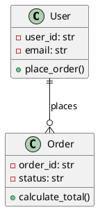

# UML Basics (Class \& Sequence Diagrams)

**UML (Unified Modeling Language)** is a visual language for modeling software systems. In backend development, **Class Diagrams** and **Sequence Diagrams** are most commonly used for system design and documentation.

***

## Class Diagrams

**Class Diagrams** show the structure of a system—classes, their attributes, methods, and relationships between classes.

### Real-World Example: E-commerce Order System

#### Python Code

```python
class User:
    def __init__(self, user_id, email):
        self.user_id = user_id
        self.email = email
        self.orders = []
    
    def place_order(self, items):
        order = Order(self, items)
        self.orders.append(order)
        return order

class Order:
    def __init__(self, user, items):
        self.order_id = self._generate_id()
        self.user = user
        self.items = items
        self.status = "pending"
    
    def calculate_total(self):
        return sum(item.price * item.quantity for item in self.items)
    
    def _generate_id(self):
        return f"ORD-{hash(self)}"

class OrderItem:
    def __init__(self, product, quantity):
        self.product = product
        self.quantity = quantity
        self.price = product.price

class Product:
    def __init__(self, name, price):
        self.name = name
        self.price = price
```


#### UML Class Diagram Representation

```
┌─────────────────┐    1      *  ┌─────────────────┐
│      User       │─────────────→│     Order       │
├─────────────────┤              ├─────────────────┤
│- user_id: str   │              │- order_id: str  │
│- email: str     │              │- status: str    │
│- orders: list   │              │- user: User     │
├─────────────────┤              │- items: list    │
│+ place_order()  │              ├─────────────────┤
└─────────────────┘              │+ calculate_total│
                                 └─────────────────┘
                                          │
                                          │ 1
                                          │
                                          │ *
                                 ┌─────────────────┐    *      1  ┌─────────────────┐
                                 │   OrderItem     │─────────────→│    Product      │
                                 ├─────────────────┤              ├─────────────────┤
                                 │- quantity: int  │              │- name: str      │
                                 │- price: float   │              │- price: float   │
                                 └─────────────────┘              └─────────────────┘
```


### Relationship Types

- **Association (→)**: User *has* Orders
- **Composition (◆)**: Order *contains* OrderItems (strong ownership)
- **Multiplicity**: `1` to `*` (one-to-many relationship)

***

## Sequence Diagrams

**Sequence Diagrams** show how objects interact over time—the flow of messages between components in a specific scenario.

### Real-World Example: Order Processing Flow

#### Python Backend Flow

```python
# API endpoint
def create_order_api(user_id, items):
    user_service = UserService()
    order_service = OrderService()
    payment_service = PaymentService()
    notification_service = NotificationService()
    
    # 1. Get user
    user = user_service.get_user(user_id)
    
    # 2. Create order
    order = order_service.create_order(user, items)
    
    # 3. Process payment
    payment_result = payment_service.charge(order.total, user.payment_method)
    
    if payment_result.success:
        # 4. Confirm order
        order_service.confirm_order(order.id)
        
        # 5. Send notification
        notification_service.send_confirmation(user.email, order)
    
    return order
```


#### UML Sequence Diagram

```
Client    API        UserService   OrderService   PaymentService   NotificationService
  │        │             │              │               │                   │
  │───────→│             │              │               │                   │
  │ POST   │             │              │               │                   │
  │ /order │             │              │               │                   │
  │        │────────────→│              │               │                   │
  │        │ get_user()  │              │               │                   │
  │        │←────────────│              │               │                   │
  │        │   user      │              │               │                   │
  │        │                           │               │                   │
  │        │─────────────────────────→│               │                   │
  │        │      create_order()       │               │                   │
  │        │←─────────────────────────│               │                   │
  │        │         order             │               │                   │
  │        │                           │               │                   │
  │        │──────────────────────────────────────────→│                   │
  │        │              charge()                     │                   │
  │        │←──────────────────────────────────────────│                   │
  │        │            payment_result                 │                   │
  │        │                           │               │                   │
  │        │─────────────────────────→│               │                   │
  │        │     confirm_order()       │               │                   │
  │        │←─────────────────────────│               │                   │
  │        │                           │               │                   │
  │        │──────────────────────────────────────────────────────────────→│
  │        │                    send_confirmation()                        │
  │←───────│                           │               │                   │
  │ response                           │               │                   │
```


***

## Production Usage at Top Companies

### Netflix: Microservices Architecture

- **Class Diagrams**: Document service interfaces and data models
- **Sequence Diagrams**: Show request flows between microservices (User Service → Recommendation Service → Content Service)


### Amazon: Order Processing

- **Class Diagrams**: Model complex inventory, pricing, and shipping relationships
- **Sequence Diagrams**: Document checkout flow across dozens of services (fraud detection, inventory, payments, shipping)


### Google: Search Architecture

- **Class Diagrams**: Define query processing pipeline components
- **Sequence Diagrams**: Show distributed search request flow across data centers

***

## Tools for UML Diagrams

### Popular Tools

- **PlantUML**: Code-based diagram generation
- **Lucidchart**: Web-based collaborative diagramming
- **Draw.io**: Free online diagramming tool
- **Mermaid**: Markdown-based diagrams (GitHub integration)


### PlantUML Example




***

## Best Practices

### Class Diagrams

- Focus on key relationships, not every detail
- Use consistent naming conventions
- Group related classes together
- Include multiplicity for relationships


### Sequence Diagrams

- Show main success scenarios first
- Include error handling flows separately
- Keep diagrams focused on specific use cases
- Use clear, descriptive message names

***

## Summary

UML diagrams bridge the gap between system design and implementation. **Class Diagrams** help visualize system structure and relationships, while **Sequence Diagrams** document dynamic behavior and message flow—essential for backend system documentation, team communication, and onboarding new developers in production environments.

